# 💻 Ambiente de Desenvolvimento React Native 📱

<div align='center'>
  <a href="https://reactnative.dev/"></a>
  <p>Configurando um ambiente de desenvolvimento no Windows para React Native.</p>
</div>

## 📥 Pré-requisitos (Links para Download)

- [Node.js](https://nodejs.org/en/download/)
- [VS Code](https://code.visualstudio.com/download)
- [Android Studio](https://developer.android.com/studio?hl=pt-br)

## 🛠️ Guia de Instalação

## 🟢 Node.js

### 📥 Download

[Clique aqui](https://nodejs.org/en/download/) para ir para a página de download.

Recomendo que sempre faça o download da última versão LTS (Long Term Support). No momeno da escrita deste tutorial a versão LTS é a _14.15.4_. Faça o download clicando no link como descrito na figura abaixo:


> Nota: com este pacote, será instalado tanto o **Node.js** como o **NPM** (Node Package Manager) que é o gerenciador de pacotes do Node.js.

### 🔨 Instalação

A instalação do Node.js é bem simples e segue o padrão de instalação da maioria dos programas do Windows (Next Next Next):


<br><br>
Aceite os termos da licença:
<br><br>

<br><br>

<br><br>
Deixe todas as opções abaixo marcadas:
<br><br>

<br><br>
Se a opção abaixo estiver marcada, **desmarque**:
<br><br>

<br><br>
Agora só clicar em _Install_ para dar início a instalação:
<br><br>


### ✅ Pós-Instalação

Após o término da instalação do Node.js, vamos verificar se ele está instalado corretamente. Para isso, execute no **Prompt de Comando do Windows** os seguintes comandos (figura abaixo) para mostrar as versões do node e npm, respectivamente:

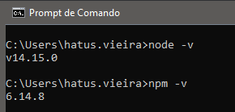

A instalação foi um sucesso!

## 📰 VS Code

### 📥 Download

[Clique aqui](https://code.visualstudio.com/download) para ir para a página de download.

Faça o download clicando no link como descrito na figura abaixo:

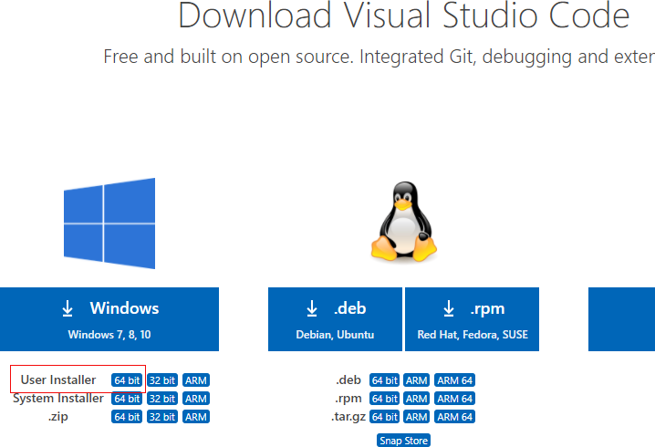

> OBS: a versão de 64 bits foi selecionada na figura acima, porque hoje em dia a maioria dos computadores são 64 bits. Mas fique a vontade para selecionar a versão correta de acordo com sua arquitetura 😀.

### 🔨 Instalação

A instalação do VS Code é tão simples quanto a do Nodejs.js: a base de Next.

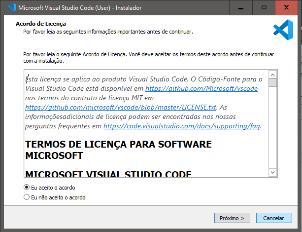
<br><br>
A opção selecionada abaixo é obrigatória, as outras ficam a seu critério:
<br><br>
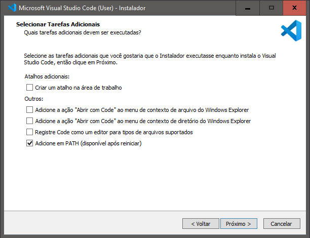
<br><br>
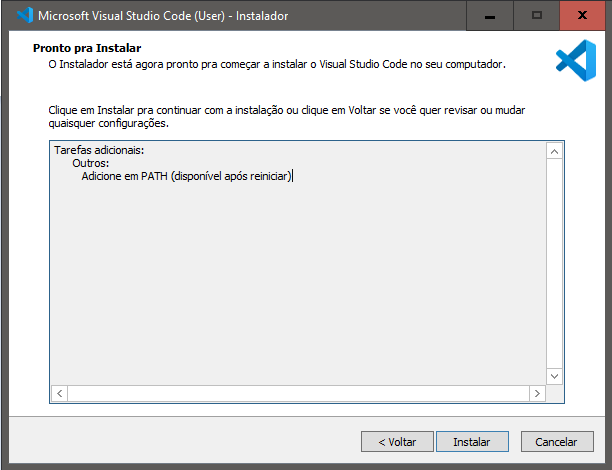
<br><br>
Pronto! VS Code instalado com sucesso.

## 🤖 Android Studio

### 📥 Download

[Clique aqui](https://developer.android.com/studio?hl=pt-br) para ir para a página de download.

Faça o download clicando no link como descrito na figura abaixo:

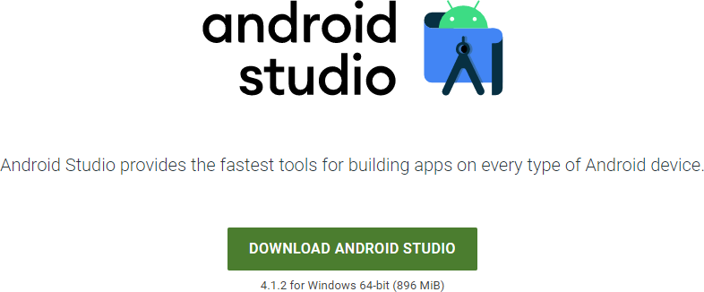

### 🔨 Instalação

Como já estamos _experts_ em clicar em _Next_, aqui não vai ser diferente:

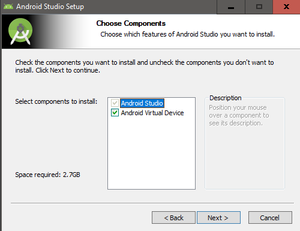

> Nota: Deixe a opção _Android Virtual Device_ marcada, pois vamos precisar do simulador de dispositivo android para o desenvolvimento.

> Nota 2: O restante da instalação é bem intuitivo, assim vou omitir alguns _prints_.

### 👨🏽‍💻 Configuração do Android Studio

Ao abrir o Android Studio, ele mostra a seguinte dela:

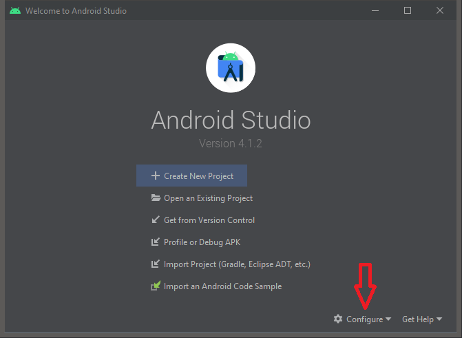

Clica em **Configure**, como indicado na imagem acima, e depois em **SDK Manager**. Irá abrir a seguinte tela:

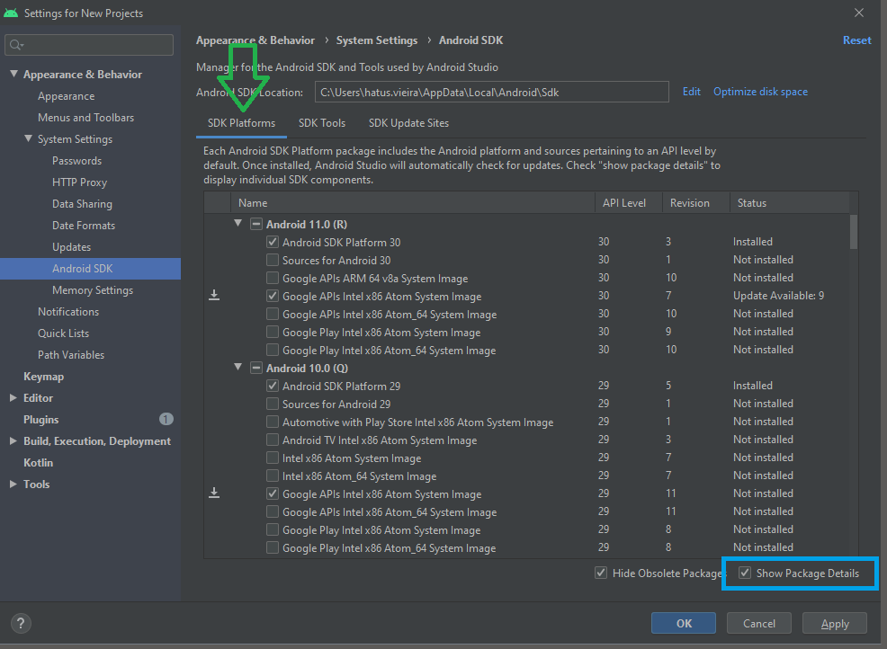

Na janela acima, selecione a checkbox _Show Package Details_, como indicado no quadrado acima da figura acima.

Após aparecer todas as opções, selecione as checkboxes que estão marcadas como na figura acima, que são elas:

- Android 11.0 (R)
  - [x] Android SDK Platform 30
  - [x] Google APIs Intel x86 Atom System Image
- Android 10.0 (Q)
  - [x] Android SDK Platform 29
  - [x] Google APIs Intel x86 Atom System Image

Clique em **Apply** para começar a instalação.

Após a instalação da _SDK Platform_, vamos instalar a _SDK Tools_. Na aba **SDK Tools** (seta verde da figura abaixo):

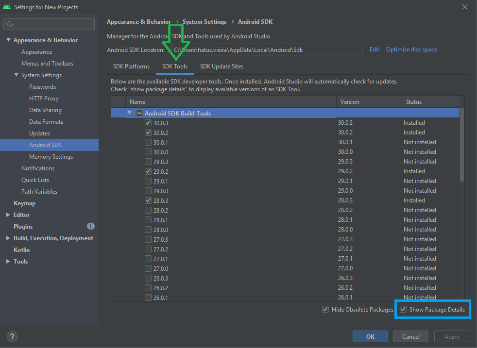

Na seção **Android SDK Build-Tools**, tenha certeza que as checkboxes estão selecionadas:

- [x] Android SDK Build-Tools
  - [x] 30.0.2
  - [x] 29.0.2

Selecione também as checkboxes abaixo:

- [x] Android Emulator
- [x] Android SDK Platform-Tools
- [x] Intel x86 Emulator Accelerator tabajara (HAXM installer)

Clique em **Apply** para começar a instalação.

✅ Pronto. Android Studio configurado com sucesso.

## 💲 Variáveis de Ambiente

Vamos configurar algumas variáveis de ambiente para completarmos a configuração.

### Variáveis `ANDROID_HOME` e `ANDROID_SDK_ROOT`

1. Abra o **Painel de Controle**.
2. Clique em **Contas de Usuário**, depois **Contas de Usuário** novamente.
3. Clique em **Alterar as variáveis do meu ambiente**.
4. Clique em **Novo...** para criar a nova variável de usuário **ANDROID_HOME** para apontar para o path do Android SDK:


5. Também crie uma nova variável de ambiente chamada **ANDROID_SDK_ROOT** com o mesmo conteúdo da variável **ANDROID_HOME**.

O SDK é instalado por padrão no diretório:

```
%LOCALAPPDATA%\Android\Sdk
```

Você pode descobrir a localização da instalação do seu SDK na seguinte imagem:

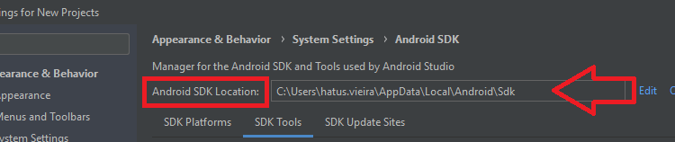

Para termos certeza que todas as variáveis foram configuradas corretamente, siga os seguintes passos:

1. Abra o powershell.
2. Copie e cole o comando `Get-ChildItem -Path Env:\`
3. E verifique se as variáveis `ANDROID_HOME` e `ANDROID_SDK_ROOT` foram adicionadas.

### Adicionando `platform-tools` e `emulator` no PATH

1. Abra o **Painel de Controle**.
2. Clique em **Contas de Usuário**, depois **Contas de Usuário** novamente.
3. Clique em **Alterar as variáveis do meu ambiente**.
4. Selecione a variável **Path**.
5. Clique em **Editar**
6. Clique em **Novo** e adicione path de `platform-tools`
   1. Path: %LOCALAPPDATA%\Android\Sdk\platform-tools
7. Clique em **Novo** e adicione path de `emulator`
   1. Path: %LOCALAPPDATA%\Android\Sdk\emulator

> Nota: coloque o Path de acordo com a instalação do seu SDK.
