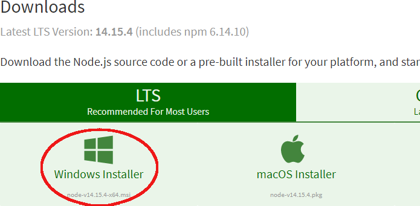
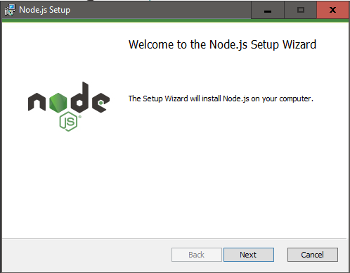
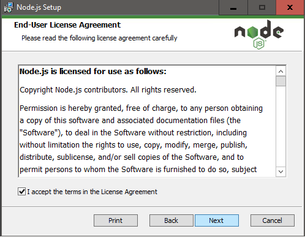
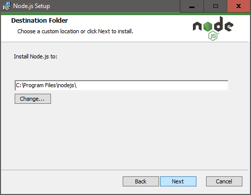
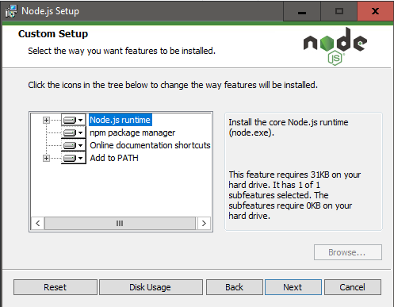
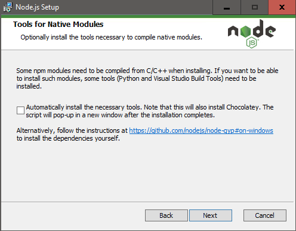
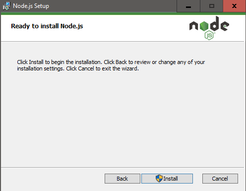

# Ambiente de Desenvolvimento React Native

## Resumo

Tutorial de como criar um ambiente de desenvolvimento no Windows para React Native.

## Pré-requisitos (Download)

- <a href="https://nodejs.org/en/download/" target="_blank">Node.js</a>
- <a href="https://code.visualstudio.com/download" target="_blank">VS Code</a>
- <a href="https://developer.android.com/studio?hl=pt-br" target="_blank">Android Studio</a>

## Guia de Instalação

## Node.js

### Download

Recomendo que sempre faça o download da última versão LTS (Long Term Support). No momeno da escrita deste tutorial a versão LTS é a _14.15.4_. Faça o download clicando no link como descrito na figura abaixo:

> Nota: com este pacote, será instalado tanto o **Node.js** como o **NPM** (Node Package Manager) que é o gerenciador de pacotes do Node.js.

### Instalação

A instalação do Node.js é bem simples e segue o padrão de instalação da maioria dos programas do Windows: Next Next Next:
  

  
Aceite os termos da licença:
  

  

  
Deixe todas as opções abaixo marcadas:
  

  
Se a opção abaixo estiver marcada, **desmarque**:
  

  
Agora só clicar em _Install_ para dar início a instalação:
  

### Pós-Instalação

## VS Code

## Android Studio
